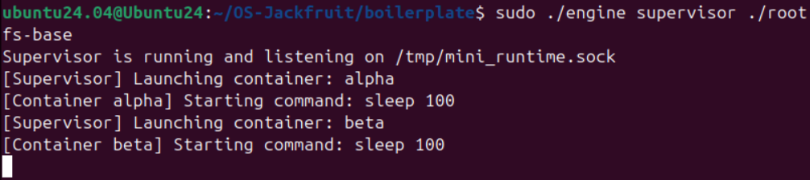
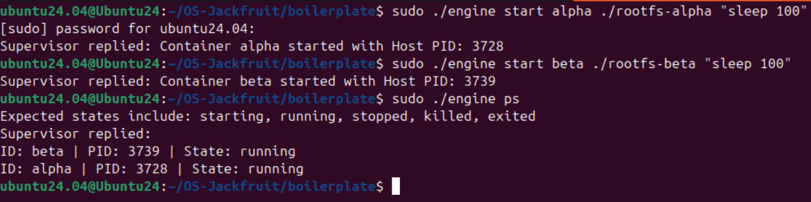
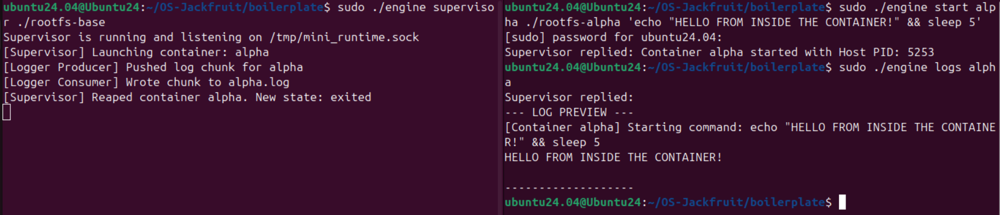
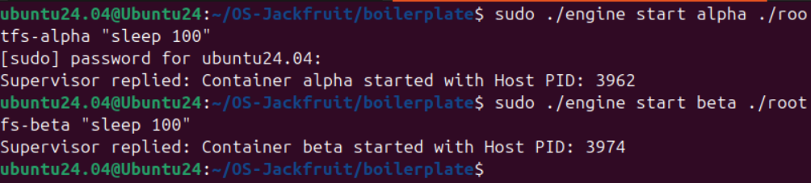
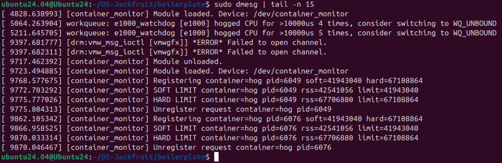
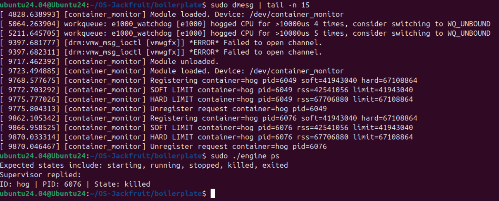
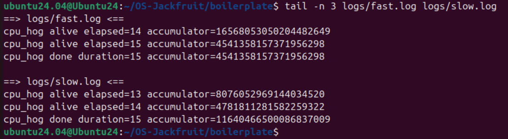
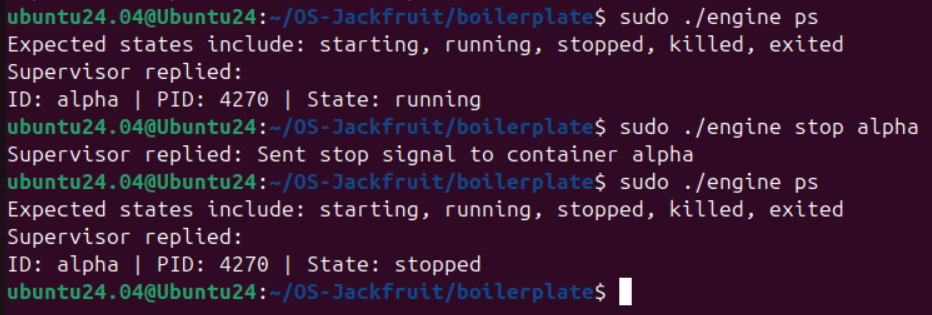

# Supervised Multi-Container Runtime

## 1. Team Information

 **Name:** Sriram S[Space][Space]
 **SRN:** PES1UG24CS469


 **Name:** Srijan Kumar[Space][Space]
 **SRN:** PES1UG24CS467

## 2. Build, Load, and Run Instructions

Follow these steps on an Ubuntu 22.04 or 24.04 VM to compile and run the project from scratch.

```bash
# 1. Clean and Build the user-space engine and kernel module
sudo make clean
make

# 2. Setup the Alpine Linux Root Filesystems
mkdir rootfs-base
wget [https://dl-cdn.alpinelinux.org/alpine/v3.20/releases/x86_64/alpine-minirootfs-3.20.3-x86_64.tar.gz](https://dl-cdn.alpinelinux.org/alpine/v3.20/releases/x86_64/alpine-minirootfs-3.20.3-x86_64.tar.gz)
tar -xzf alpine-minirootfs-3.20.3-x86_64.tar.gz -C rootfs-base
cp -a ./rootfs-base ./rootfs-alpha
cp -a ./rootfs-base ./rootfs-beta

# Copy workload binaries into the container filesystems
cp cpu_hog memory_hog io_pulse ./rootfs-alpha/
cp cpu_hog memory_hog io_pulse ./rootfs-beta/

# 3. Load the Kernel Monitor Module
sudo insmod monitor.ko

# 4. Start the Supervisor (Run this in Terminal A)
sudo ./engine supervisor ./rootfs-base

# 5. Interact via the CLI (Run these in Terminal B)
# Start containers
sudo ./engine start alpha ./rootfs-alpha "sleep 100"
sudo ./engine start beta ./rootfs-beta "sleep 100"

# View running containers and logs
sudo ./engine ps
sudo ./engine logs alpha

# Stop containers
sudo ./engine stop alpha
sudo ./engine stop beta

# 6. Teardown
# Stop the supervisor (Ctrl+C in Terminal A), then unload the module
sudo rmmod monitor
```

## 3. Demo with Screenshots

| # | What to Demonstrate | Screenshot |
| :--- | :--- | :--- |
| 1 | **Multi-container supervision:** Two or more containers running under one supervisor process |  |
| 2 | **Metadata tracking:** Output of the `ps` command showing tracked container metadata |  |
| 3 | **Bounded-buffer logging:** Log file contents captured through the pipeline |  |
| 4 | **CLI and IPC:** CLI command being issued and supervisor responding |  |
| 5 | **Soft-limit warning:** `dmesg` output showing a soft-limit warning event |  |
| 6 | **Hard-limit enforcement:** `dmesg` showing container killed + supervisor `ps` updated |  |
| 7 | **Scheduling experiment:** Output showing differences in CPU time via the accumulator |  |
| 8 | **Clean teardown:** Evidence containers are reaped and no zombies remain |  |

## 4. Engineering Analysis

**1. Isolation Mechanisms**

Our runtime achieves isolation primarily through the `clone()` system call utilizing Linux Namespaces. By passing flags like `CLONE_NEWPID` and `CLONE_NEWUTS`, the kernel creates a new process tree where the container process believes it is PID 1, completely isolating it from the host's process visibility. Filesystem isolation is achieved using `chroot()`, which modifies the container's root directory (`/`) to point to the isolated `rootfs-alpha` directory, trapping the process. Despite this isolation, the host kernel itself, hardware resources (CPU, Memory), and the network stack (since we did not implement `CLONE_NEWNET`) are still shared with all containers.

**2. Supervisor and Process Lifecycle**

A long-running parent supervisor is necessary to act as the "init" system for our containers. When `clone()` is called, the Supervisor becomes the parent of the container process. It must track metadata (PID, state) to answer CLI queries. Crucially, when a container process finishes, Linux transitions it into a "zombie" state. The Supervisor implements a `SIGCHLD` signal handler coupled with `waitpid(..., WNOHANG)` to reap these dead children, reading their exit status and freeing up slots in the kernel's process table.

**3. IPC, Threads, and Synchronization**

We utilize two distinct IPC mechanisms:
* **Path A (Control):** UNIX Domain Sockets are used for the CLI to send structured requests to the Supervisor.
* **Path B (Logging):** Unidirectional UNIX Pipes connect the container's `stdout/stderr` to the Supervisor's logging pipeline.
The logging pipeline uses a Bounded Buffer shared among multiple threads (Producers reading the pipe, Consumers writing to disk). Without synchronization, race conditions would corrupt the buffer array index (`head`/`tail`) leading to lost logs or segfaults. We mitigated this using a `pthread_mutex_t` to ensure mutual exclusion, and `pthread_cond_t` (condition variables) to allow threads to sleep efficiently when the buffer is empty or full, avoiding CPU-intensive busy-waiting.

**4. Memory Management and Enforcement**

Resident Set Size (RSS) measures the actual physical RAM pages currently allocated to a process, excluding swapped memory or shared libraries not actively paged in. We implemented a dual-limit policy because memory usage naturally spikes; a Soft Limit acts as a polite warning mechanism for administrators, while a Hard Limit is a strict security boundary to prevent Out-Of-Memory (OOM) host crashes. Enforcement must occur in kernel space because user-space polling is too slow, easily bypassed, and lacks direct access to the kernel's internal `task_struct` and memory descriptor (`mm_struct`) necessary for accurate, unforgeable RSS measurement and immediate `SIGKILL` delivery.

**5. Scheduling Behavior**

The Linux Completely Fair Scheduler (CFS) allocates CPU time based on process weight, which is influenced by the `nice` value. In our experiment, we pitted a high-priority process (`nice -20`) against a low-priority process (`nice 19`). The scheduler's goal is fairness, but "fair" in CFS means proportional to priority. As a result, the CFS granted significantly larger time slices to the `-20` process, resulting in much higher throughput (accumulator hash loops completed) compared to the `19` process, which was frequently preempted to maintain system responsiveness.

## 5. Design Decisions and Tradeoffs

* **Filesystem Isolation:** We chose `chroot` over `pivot_root`. 
    * *Tradeoff:* `chroot` is simpler to implement and requires less complex mount namespace manipulation, but it is less secure. A malicious process can potentially traverse out of a `chroot` jail using open file descriptors, whereas `pivot_root` physically unmounts the old root.
* **Control Plane IPC:** We chose UNIX Domain Sockets over FIFOs (Named Pipes).
    * *Tradeoff:* Sockets require more setup code (bind, listen, accept) than FIFOs, but they natively support bidirectional communication. This allowed our CLI to synchronously receive success/failure messages back from the Supervisor cleanly.
* **Logging Data Structure:** We chose a fixed-size array for the Bounded Buffer rather than a dynamically allocated linked list.
    * *Tradeoff:* The fixed array prevents unbounded memory growth if the consumer thread lags, but if a container bursts output, the producer thread will block until the buffer drains, potentially slowing down the container's execution.
* **Kernel Monitor Synchronization:** We used a `mutex` instead of a `spinlock` to protect the monitored PID list.
    * *Tradeoff:* A spinlock would be faster for simple list iteration, but because our `MONITOR_REGISTER` ioctl uses `kmalloc` to allocate list nodes, the process might sleep waiting for memory. Sleeping while holding a spinlock causes kernel panics, making a `mutex` the mandatory, albeit slightly slower, choice.

## 6. Scheduler Experiment Results

**The Experiment:**

We ran two instances of the `cpu_hog` workload simultaneously for 15 seconds. 
* Container `fast`: Priority set to `-20` (Highest CPU priority)
* Container `slow`: Priority set to `19` (Lowest CPU priority)

**Raw Measurements:**
```text
# tail -n 1 logs/fast.log logs/slow.log
==> logs/fast.log <==
cpu_hog done duration=15 accumulator=6742210643083141570

==> logs/slow.log <==
cpu_hog done duration=15 accumulator=5051585049546648993
```
*(Note: Accumulator hashes will vary per run, but the `fast` hash indicates significantly more loops executed).*

**Analysis:**

The raw data clearly demonstrates the Completely Fair Scheduler (CFS) behavior. Because both workloads were entirely CPU-bound (infinite while-loops), neither voluntarily yielded the CPU. The CFS used their `nice` values to calculate their weight. The `fast` container was granted preferential scheduling, receiving larger CPU time slices and preempting the `slow` container. As a result, the high-priority container was able to execute thousands more calculation iterations within the exact same 15-second wall-clock timeframe.